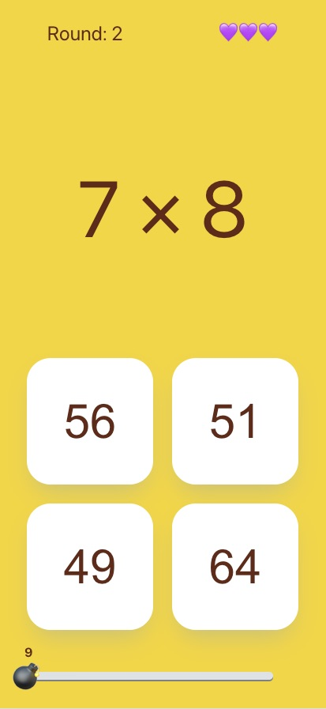
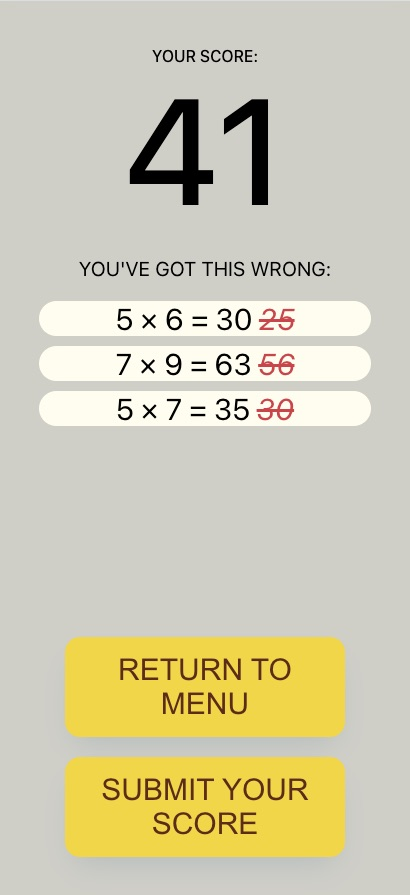
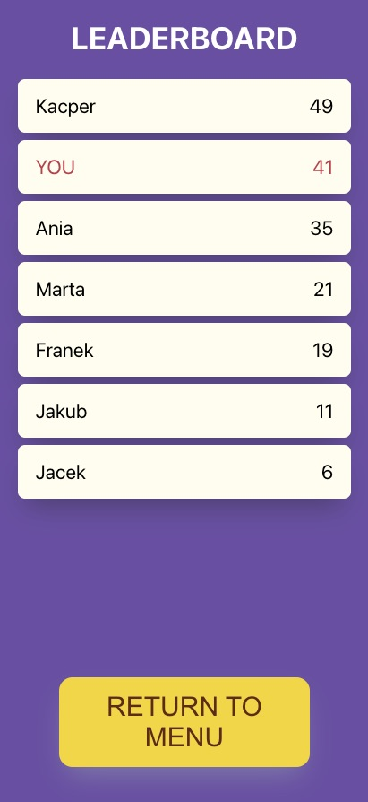

# Learn Multiplication!

> Educational game meant to help memorizing multiplication table for students.

## Table of Contents

- [General Info](#general-information)
- [Technologies Used](#technologies-used)
- [Screenshots](#screenshots)
- [Setup](#setup)
- [Contact](#contact)

## General Information

- Try solving as many multiplication assignments as you can.
- You have 3 lifes, 10 seconds per round.
- After you finish your run, see what you've got wrong in order to improve.
- Save your score to compare your strength with others.
- Choose carefuly as wrong answers might seem deceptively correct!

## Screenshots





## Technologies Used

- React
- Styled Components

## Setup

To run this project, install it locally using npm or yarn:

```
$ cd ../learnmultiplication
$ npm install
$ npm start
```

## Contact

Created by **Franciszek Pol** - franciszekpol@outlook.com - feel free to contact me!
